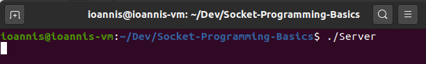
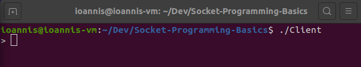
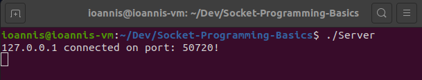
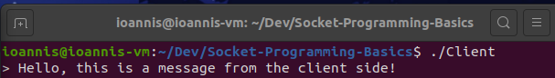
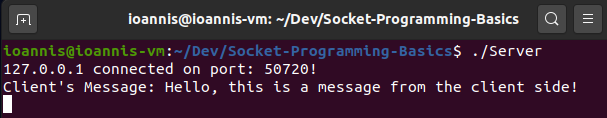
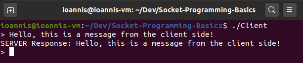

# Client/Server
A simple Client/Server application written in C++ using sockets to send and receive back a message.
<br>

## Steps:
### Compile the server.cpp file
```cpp
g++ server.cpp -o Server
```

### Compile the client.cpp file
```cpp
g++ client.cpp -o Client
```

### Run the Server
```cpp
./Server
```


### Run the Client 
```cpp
./Client
```


### Observe the server side



### Type in the message you wish the Client to send. 

*The Server will display the received message and then respond back to the Client with the same message:*



